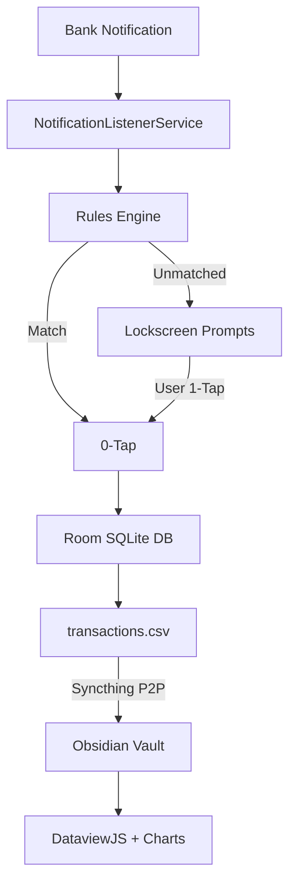

# Smart Expense Tracker & Notification Parser

A robust, local-first personal finance system built out of practical necessity: strict real-time expense tracking without relying on fragile bank-scraping APIs (Plaid/Belvo), privacy-invasive cloud fintechs, or manual bookkeeping friction.

*Modern, reactive UI built entirely with Jetpack Compose and Material Design 3.*

---

## Architecture & Core Workflow

The system operates on an event-driven, zero-cloud pipeline that transitions from raw Android system events to persistent analytics in under 200 ms:

### 1. Zero-Tap Ingestion & Event Interception
* Intercepts incoming transactions from specific financial apps (e.g., BBVA, Nu, BanCoppel) via an isolated Android `NotificationListenerService`.
* Pre-filters system payloads and applies tokenizing regular expressions to extract currency amounts, merchant descriptions, and transaction direction (debit vs. credit).

### 2. Intelligent Auto-Categorization (0-Tap vs. 1-Tap)
* **Rule Engine (0-Tap):** Evaluates incoming merchant strings against user-defined token heuristics in local storage. Known merchants (e.g., transit, recurring groceries, subscriptions) are confirmed and logged silently in the background.
* **Interactive Lockscreen Actions (1-Tap):** When a transaction is unrecognized, the app dispatches an interactive notification equipped with inline action chips, allowing category triage directly from the lockscreen without opening the UI.

### 3. Local-First Persistence & Storage Access Framework (SAF)
* All transactions and balance changes are committed atomically to a local **Room (SQLite)** database to ensure ACID compliance and historical state rollback capabilities.
* In parallel, validated entries are appended to a plain `transactions.csv` using Android's **Storage Access Framework (SAF)**, allowing sandboxed file manipulation directly inside an Obsidian vault directory.

### 4. P2P Sync & Analytics Dashboard
* **Syncthing:** Synchronizes the flat ledger file peer-to-peer and TLS-encrypted between mobile devices and desktop workstations without intermediaries.
* **Obsidian Analytics Layer:** Built with **DataviewJS** and **Chart.js** (`obsidian-charts`). Computes real-time KPI metrics, dynamic multi-period filters, burn-rate trendlines, and categorical spending distributions directly over plain text.

---

## Technical Highlights & Engineering Decisions

* **Declarative Mobile UI:** Built with **Jetpack Compose**, featuring dynamic spending breakdowns (donut & categorical distributions), multi-account balance calibration, internal transfers/ATM reconciliations, and transactional history management.
* **Resource Optimization:** Optimized background service lifecycle with non-blocking Kotlin Coroutines (`Dispatchers.IO`), memory-efficient regex evaluation, and strict package whitelisting to eliminate idle battery drain.
* **Sovereign Privacy:** Zero analytics, zero crash telemetry, and zero network calls. Financial data remains exclusively on owned hardware in open, non-proprietary formats.